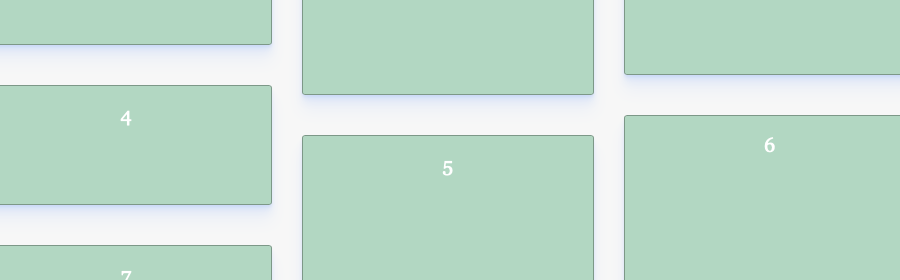

# Flexbox Masonry Reloaded

## About the project
A flexbox-powered masonry layout, based on [@tobiasahlin's awesome solution](https://tobiasahlin.com/blog/masonry-with-css/).

With CSS Custom Properties and a little bit of JavaScript:
* *Automatic container height* — No fixed height needed
* *Customizable gutter size* — Simply change `--gutter` in the CSS
* *Responsive* — Collapses into fewer columns on specified `@media` breakpoints

### More columns
The JavaScript works with any amount of columns, but needs some tweaking in the HTML and the CSS. See [Tobias's blog post](https://tobiasahlin.com/blog/masonry-with-css/) for more info on that (not the exact same fix, but similar).

## Usage
[**Check it out live**](https://alexandersandberg.github.io/theme-switcher/) *or* download the files and open `index.html` in your preferred browser.

## A project by Alexander Sandberg
Thanks for checking out my project! ❤️

If you want to get in touch, or check out my other work, you can find me online here:
* [Website](https://alexandersandberg.com) (alexandersandberg.com)
* [Twitter](https://twitter.com/alexandberg) (@alexandberg)
* [Medium](https://medium.com/@alexandersandberg) (@alexandersandberg)
* [Instagram](https://www.instagram.com/sandbergalexander/) (@sandbergalexander)
* [LinkedIn](https://www.linkedin.com/in/sandbergalex/) (@sandbergalexander)

## License
Distributed under the MIT License © [Alexander Sandberg](https://github.com/alexandersandberg)
